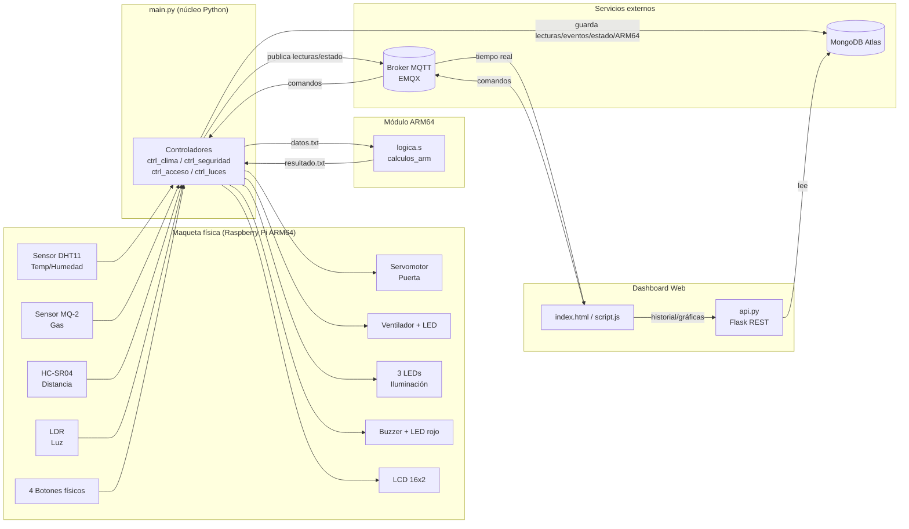

# Arquitectura del Sistema — Edificio Inteligente IoT

## Visión general

## Componentes

| Componente | Archivo | Responsabilidad |
|---|---|---|
| Núcleo Python | `backend/main.py` | Bucle principal, botones físicos, LEDs de estado global, generación de `datos.txt`, ejecución del binario ARM64, publicación MQTT |
| Clima | `backend/controllers/ctrl_clima.py` | DHT11, ventilador, umbral de temperatura |
| Seguridad | `backend/controllers/ctrl_seguridad.py` | MQ-2 (vía PCF8591/I2C), buzzer, LED rojo |
| Acceso | `backend/controllers/ctrl_acceso.py` | HC-SR04, servomotor de puerta |
| Luces | `backend/controllers/ctrl_luces.py` | LDR (vía PCF8591/I2C), 3 LEDs, modo automático/manual |
| Pantalla | `backend/view/lcd_view.py` | Rotación de información en LCD 16x2 |
| Módulo ARM64 | `backend/arm64/logica.s` | Lectura de `datos.txt`, cálculo máx/mín/promedio/cuenta, escritura de `resultado.txt` |
| Persistencia | `backend/models/*.py` | Esquemas y acceso a colecciones de MongoDB Atlas |
| API REST | `backend/api.py` | Endpoints de historial/gráficas consumidos por el dashboard |
| Dashboard | `frontend/index.html`, `frontend/script.js` | Visualización en vivo (MQTT), gráficas e historial (REST), controles remotos (MQTT) |

## Flujo de datos ARM64

Ver [`flujo_arm64.md`](flujo_arm64.md).

## Topics MQTT y colecciones MongoDB

Ver [`mqtt_topics.md`](mqtt_topics.md) y [`mongodb_schema.md`](mongodb_schema.md).
