# Diagrama de conexiones físicas (pines GPIO — BCM)

Basado en los pines usados actualmente en el código (`backend/main.py` y
`backend/controllers/*.py`).

```mermaid
flowchart TB
    RPI["Raspberry Pi (GPIO - modo BCM)"]

    RPI -->|GPIO4| DHT[DHT11 - datos]
    RPI -->|GPIO5| VENTREL[Relé/Transistor Ventilador]
    RPI -->|GPIO6| LEDVENT[LED indicador ventilación]

    RPI -->|GPIO23| TRIG[HC-SR04 TRIG]
    RPI -->|GPIO24| ECHO[HC-SR04 ECHO]
    RPI -->|GPIO12| SERVO[Servomotor SG90 - señal PWM]

    RPI -->|GPIO21 / 18 / 14| LEDS3[3 LEDs de iluminación]

    RPI -->|GPIO26| LEDROJO[LED rojo emergencia]
    RPI -->|GPIO16| BUZZER[Buzzer]

    RPI -->|GPIO13| LEDVERDE[LED estado NORMAL]
    RPI -->|GPIO19| LEDAMARILLO[LED estado ADVERTENCIA]

    RPI -->|GPIO17| BTNPUERTA[Botón: abrir/cerrar puerta]
    RPI -->|GPIO27| BTNLUCES[Botón: modo luces AUTO/MANUAL]
    RPI -->|GPIO22| BTNSILENCIAR[Botón: silenciar buzzer]
    RPI -->|GPIO25| BTNRESET[Botón: restablecer alerta]

    RPI -->|I2C bus 1, 0x48| PCF[PCF8591 - ADC]
    PCF -->|AIN0| LDR[Sensor LDR]
    PCF -->|AIN1| MQ2[Sensor MQ-2/MQ-135]

    RPI -->|I2C, 0x27| LCD[LCD 16x2]
```

## Tabla de pines

| Pin BCM | Función | Controlador |
|---|---|---|
| 4 | DHT11 (dato) | `ctrl_clima.py` |
| 5 | Ventilador | `ctrl_clima.py` |
| 6 | LED indicador de ventilación | `ctrl_clima.py` |
| 23 | HC-SR04 TRIG | `ctrl_acceso.py` |
| 24 | HC-SR04 ECHO | `ctrl_acceso.py` |
| 12 | Servomotor (PWM) | `ctrl_acceso.py` |
| 21, 18, 14 | 3 LEDs de iluminación | `ctrl_luces.py` |
| 26 | LED rojo de emergencia | `ctrl_seguridad.py` |
| 16 | Buzzer | `ctrl_seguridad.py` |
| 13 | LED verde (estado NORMAL) | `main.py` |
| 19 | LED amarillo (estado ADVERTENCIA) | `main.py` |
| 17 | Botón puerta | `main.py` |
| 27 | Botón modo luces | `main.py` |
| 22 | Botón silenciar buzzer | `main.py` |
| 25 | Botón restablecer alerta | `main.py` |
| I2C (0x48) | PCF8591 — LDR (AIN0) y MQ-2 (AIN1) | `ctrl_luces.py`, `ctrl_seguridad.py` |
| I2C (0x27) | LCD 16x2 | `lcd_view.py` |

> Nota: no hay un pin GPIO dedicado documentado en el código para "LED rojo
> = estado EMERGENCIA" del sistema de estado global (sección 5 del
> enunciado); el pin 26 se usa como LED de alarma de gas dentro de
> `ctrl_seguridad.py`. Vale la pena aclarar en la documentación si ese mismo
> LED cumple ambos roles (alarma de gas + estado global EMERGENCIA) o si se
> necesita uno adicional — esta nota es solo para la documentación, no
> implica ningún cambio de código.
