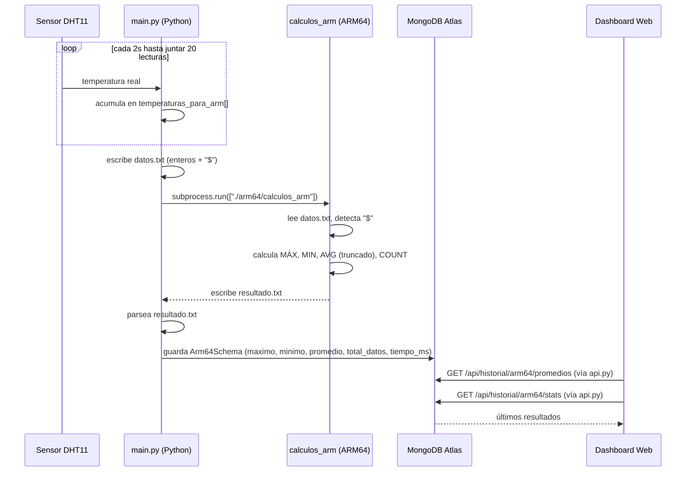

# Flujo Python → ARM64 → MongoDB → Dashboard



## Restricción cumplida

Todo el cálculo de máximo, mínimo, promedio y conteo se realiza en
`backend/arm64/logica.s` (AArch64), no en Python. `main.py` únicamente:

1. Genera `datos.txt` con lecturas reales de temperatura.
2. Ejecuta el binario `calculos_arm`.
3. Lee `resultado.txt`.
4. Guarda el resultado en MongoDB Atlas.

## Formato de archivos

**`datos.txt`** — un entero por línea, terminado en `$`:

```
23
25
21
27
$
```

**`resultado.txt`** — formato fijo:

```
MÁX=27
MIN=21
AVG=24
COUNT=4
```

## Pendiente

- Publicar el resultado también por MQTT en el topic `edificio/arm64/resultados`
  (ver [`mqtt_topics.md`](mqtt_topics.md)) — hoy solo llega al dashboard vía
  REST, no vía MQTT.
